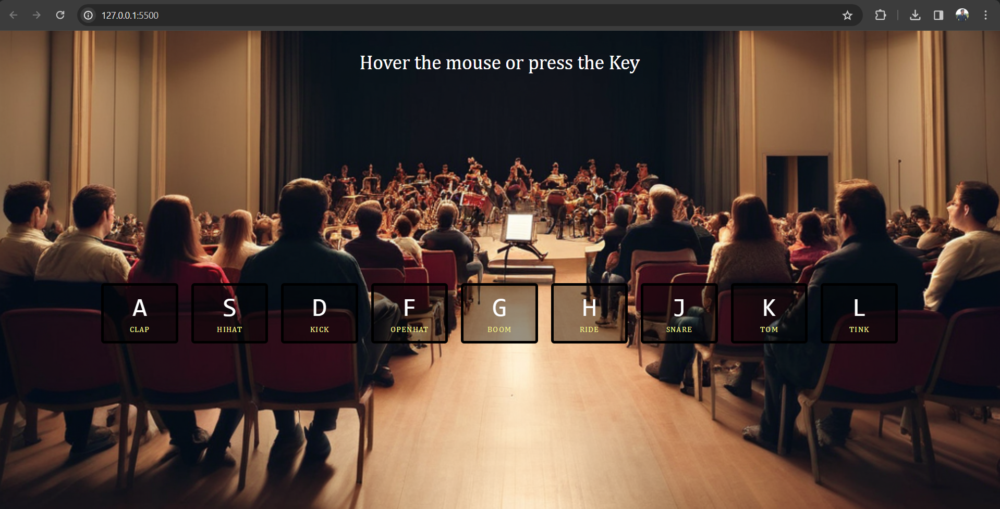

# Drum Kit

Drum Kit is a simple web application that allows users to play drum sounds by either pressing keys on the keyboard or hovering over drum elements with the mouse pointer.



## Features

- Nine different drum sounds available.
- Users can trigger sounds either by pressing the corresponding keys on the keyboard or hovering over the drum elements with the mouse pointer.
- Interactive UI with visual feedback on key press or hover.

## Installation

1. Clone the repository:

```bash
[git clone https://github.com/AbidKhan01ak/drum-kit.git](https://github.com/AbidKhan01ak/DrumKit_JS.git)
```
## Usage
Press the corresponding keys on your keyboard (A, S, D, F, G, H, J, K, L) to play drum sounds.
Hover over the drum elements with your mouse pointer to play sounds.
Contributing
Contributions are welcome! If you find any bugs or have suggestions for new features, please open an issue or submit a pull request.

## License
This project is licensed under the MIT License - see the [LICENSE](LICENSE) file for details.
